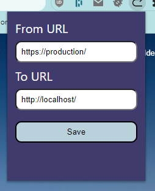

# _Redirect to local dev environment_

### **About this plugin**

Just a cool addon that lets you, by hovering a link and pressing the hotkey (**currently ctrl + b**), to open your local environment with the url path!

### **Installation guide**

Guide will follow soon...

### **Feature ideas for version 2.0**

- better UI design
- customize hotkey
- add custom http query or/and fragments to the request (e.g. `?debug=true` or `#top`)
- export settings to file (or sync it to cloud?)
- help site

#### other future ideas:

- bringing this plugin to the Chrome Web Store
- port this plugin to other browsers to Firefox

Feel free to create an issue for new feature ideas or if you want, you can also create a PR with your features/optimisations!

### **Project Screenshots and real life examples**

more examples will follow
